# Tri-Nethra Mobile App

#Please mind this is not a part of the project, just a mere extension which can added later.

A multi-Platform mobile application, which we intend to use in future if needed.
Not in current use because of the software domain Web App

These are the screen shots of it
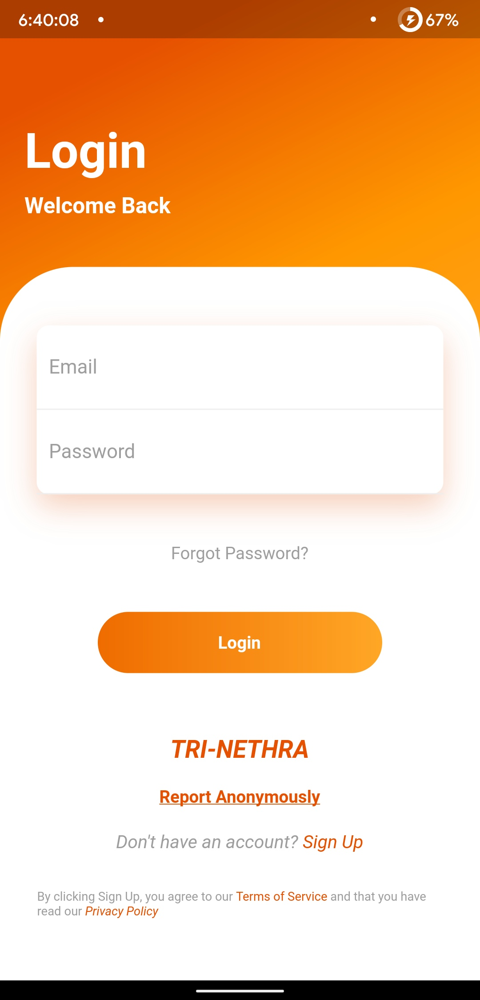
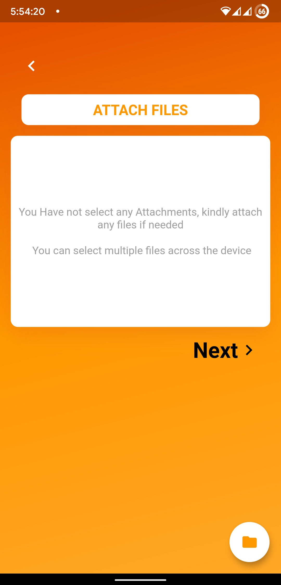
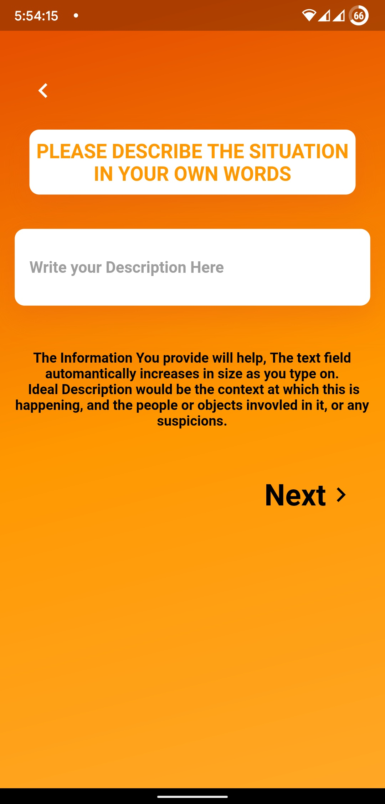
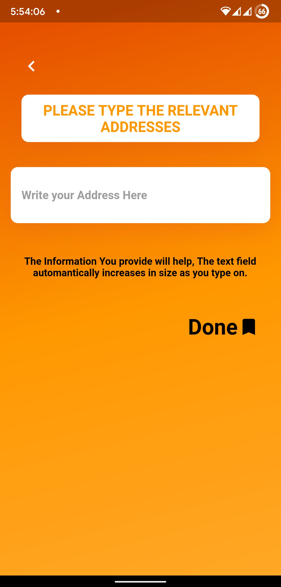
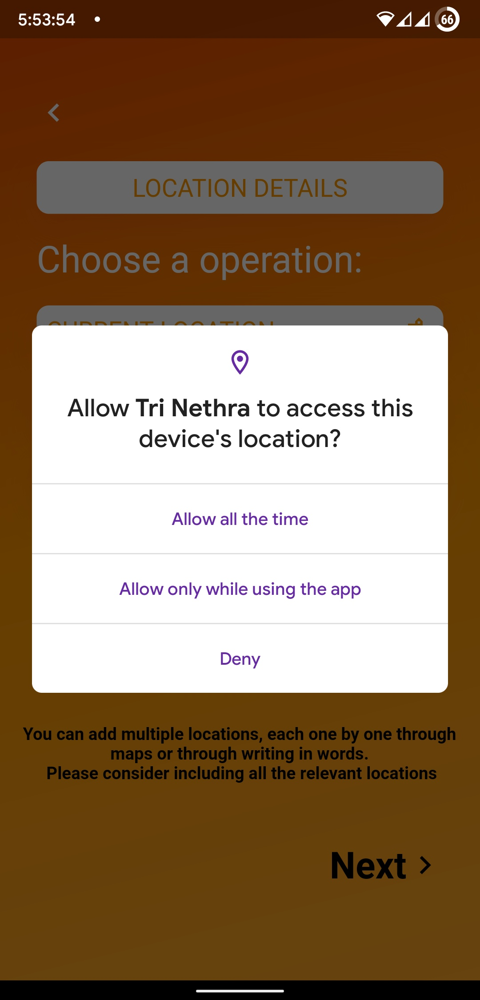
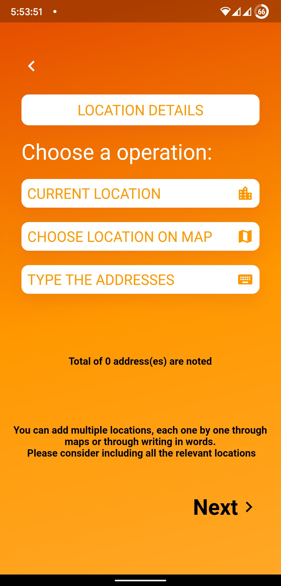
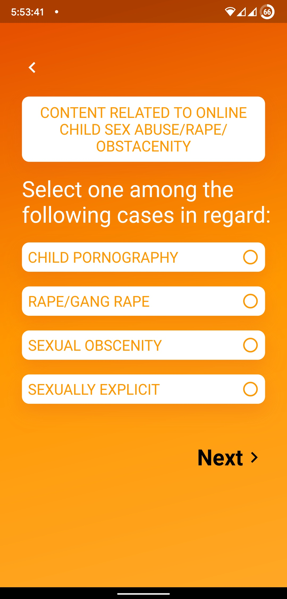
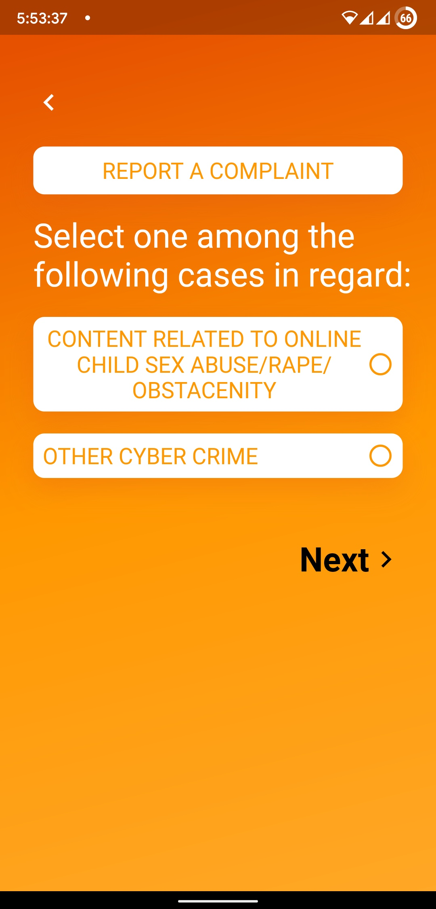
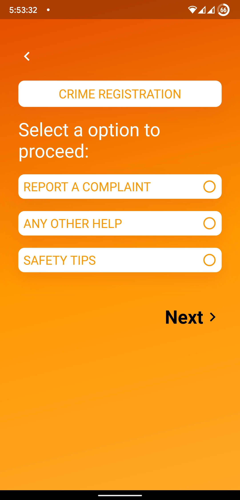
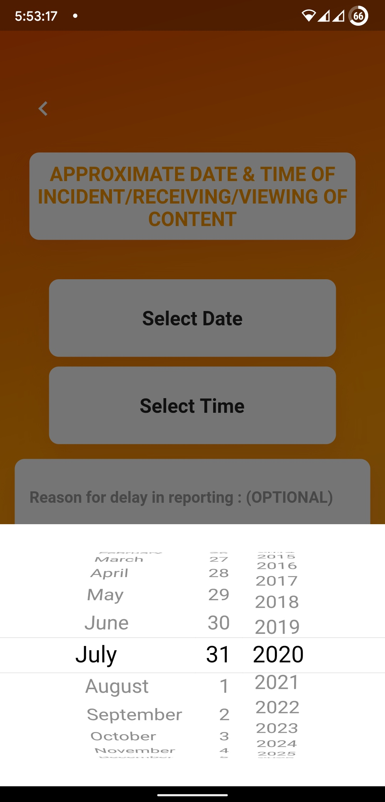
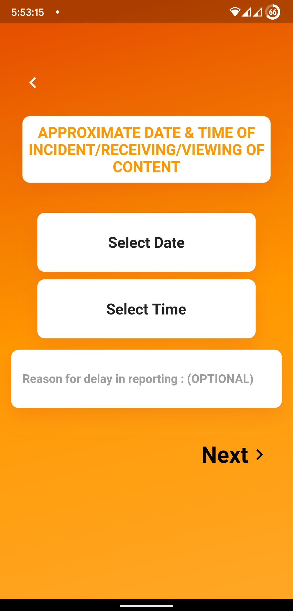
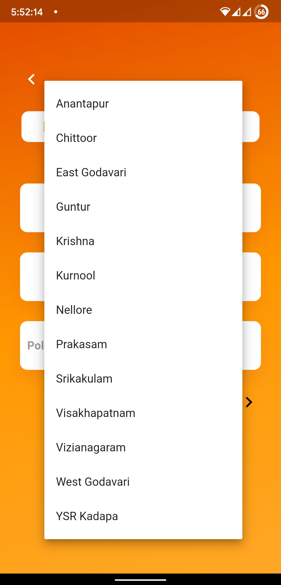
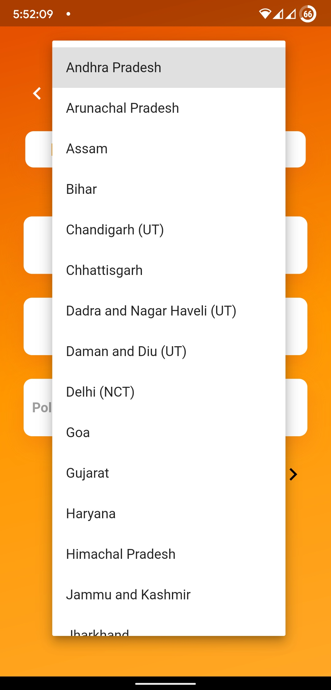

## Getting Started

This project is a starting point for a Flutter application.

A few resources to get you started if this is your first Flutter project:

- [Lab: Write your first Flutter app](https://flutter.dev/docs/get-started/codelab)
- [Cookbook: Useful Flutter samples](https://flutter.dev/docs/cookbook)

For help getting started with Flutter, view our
[online documentation](https://flutter.dev/docs), which offers tutorials,
samples, guidance on mobile development, and a full API reference.
