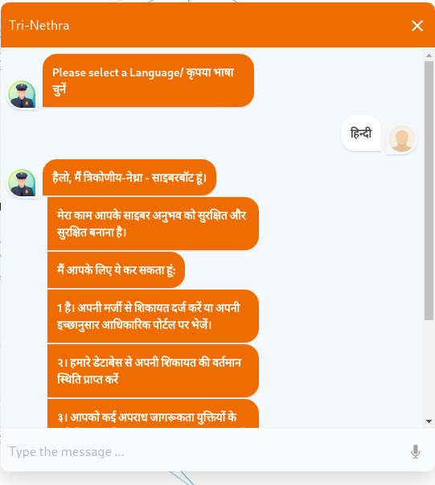
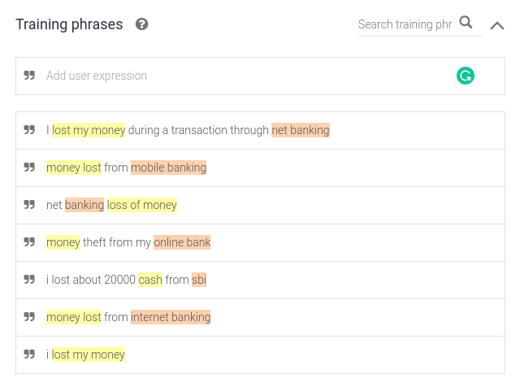
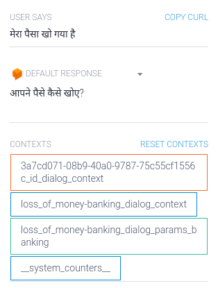
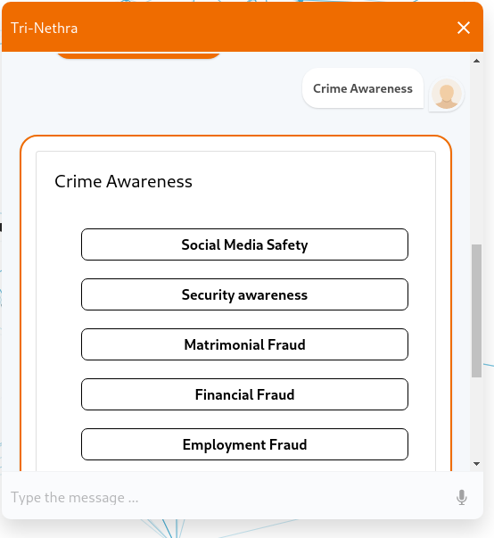
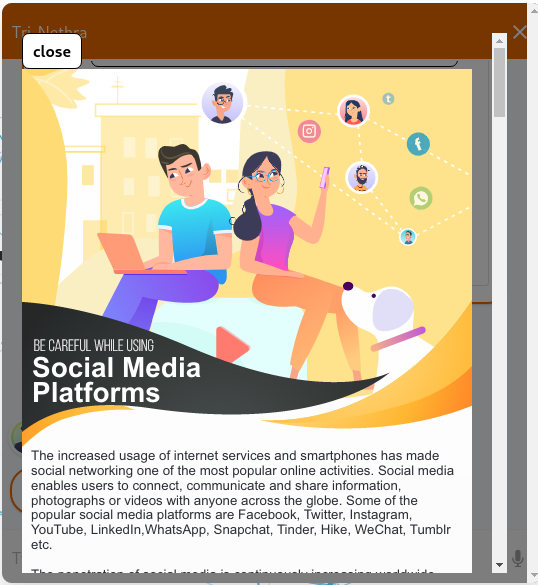
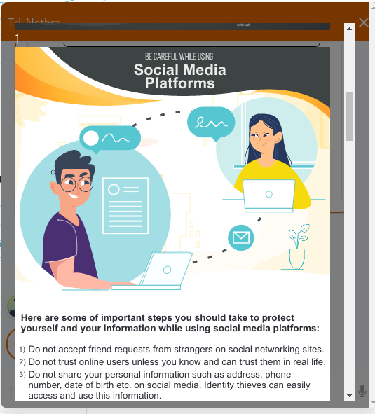
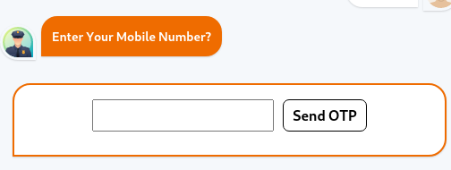
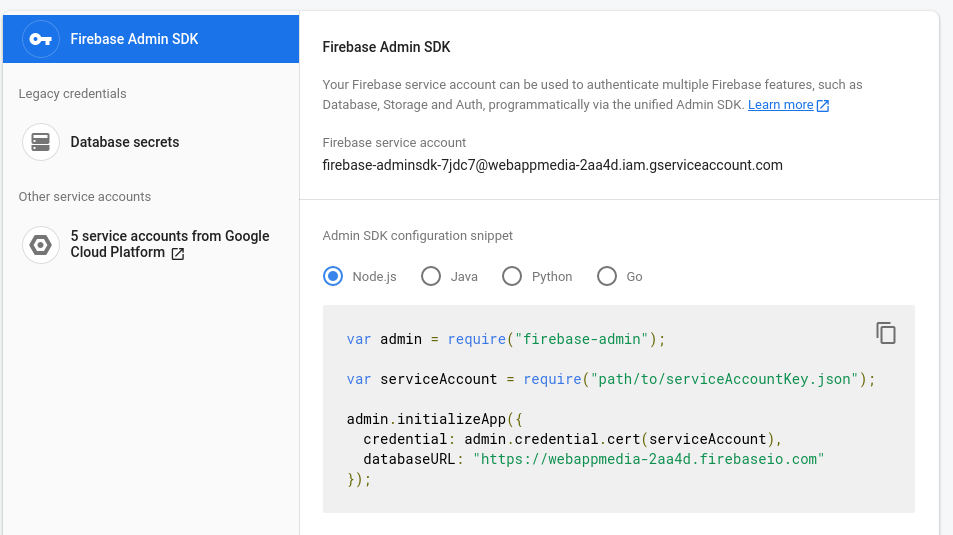

## Multi-Lingual Processing
The Bot will be able to handle multiple Languages, natively.
Now supports Hindi and English

Even the text can be given in Hindi format and the bot understands (it was even trained to take up multilingual approach not just only English)

## Natural Language Processing and Machine Learning

The Bot is able to understand the intents of the user and is able to convey the same to the database seamlessly

It's been trained on two main intents as of now, as suggested by the Jury.

Can take as many intents as possible by training it.

## PDF Generation
Whenever the report is generated a Clean PDF report is generated for further purposes and reference purposes.
We can even claim the pdf's if the Tracking ID is known.

Mailing of PDF is also done automatically

## Attachment Block

The User can __attach any kind of extension files __not just limited to jpg, or pdfs.

## Unique Tracking ID
Whenever the user reports a complaint the system will provide them a Unique Mixed Case Alpha-Numeric Characters Unique ID which can be used
for all further enquires.

Each Issue is attached to this Tracking ID

## Data Set chosen

The Dataset chosen for the crime intents and their categories is from the below picture.

As per the Jury requirements we have given NLP training to 2 intents and all these intents can also be trained the same way.

  

The data set chosen is present in jsons file

## Crime Awareness

Crime awareness is done through showing intuitive content to users when asked.
The content Links are as follows.

They're provided by BPRD (Problem Statement Provider) Website.

## Speech to Text
Speech to text is added for more ease of use and accessibility features.

Works in the updated Chromium-based browsers.

## Anonymity or Identity

Considering the suggestions by Jury, The Bot also has an anonymity feature if the User intends to use it.

If the user chooses to reveal his identity, there would be OTP authentication, and the flow proceeds further.

## The Report Data
All the Data chosen is easy to understand and yet concise enough to get a stronghold of information from the user.

It's made flexible that any data field asked by the police can easily be added or removed or manipulated by the respective authorities.

# Security Features

## Query Limiting
The Bot is smart enough to Understand if the client-side messages are not legit or valid, It can defend stating the same.

Here is the example of __Randomly Generated 55 paragraphs, 5000 words, 33996 bytes of Lorem Ipsum __, but the bot is smart enough to defend it.

[Data generated by LipSum](https://www.lipsum.com/ "LipSum")

## Client-Side Querying
All the Queries are handled at the clientside first and then to the server, So there is no chance of breaking the server 

Hence Machine load will be taken by the server even multiple users are working simultaneously all the time.

## Encryption

We know we're dealing with sensitive information, so no data is spared from encryption

_Everything is encrypted with industry standards __AES-256__ encryption_.

[AES-256 Encryption](https://www.solarwindsmsp.com/blog/aes-256-encryption-algorithm/ "AES-256 Encryption")

## IP Address

We're taking IP address information from the users, so there would be no possible dead end for the authorities at the least when the users choose to stay anonymous.

Multiple calls from the same IP can be enabled to raise flags in the system.

[Public IP importance](https://www.lifewire.com/what-is-a-public-ip-address-2625974 "Public IP Importance")

## Role-Based Privileges
The System will be given a role-based management system to be integrated later, and permission can be given as who can view, modify, fetch data as such as per the personnel.

This helps to integrate this into any existing system.
